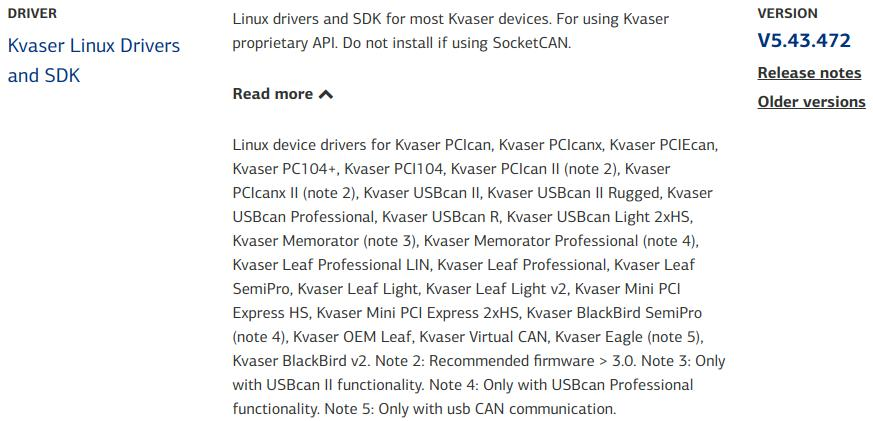

# kvaser_can_rospkg

*You can utilize this ROS package to integrate Kvaser CAN/CAN FD devices into the ROS environment..*

*Compile as C++11, supported in ROS Kinetic and newer.*


## Dependencies
:one:: Ubuntu 20.04  (ROS1 Noetic)
:two:: [Kvaser Linux Drivers and SDK](https://www.kvaser.com/download/?utm_source=software&utm_ean=7330130980754&utm_status=latest)

❗️ Linux drivers and SDK for most Kvaser devices. For using Kvaser proprietary API. Do not install if using SocketCAN.

<div align=center>
  
</div>


## Build
```shell
mkdir -p YOUR_DIR/src
cd YOUR_DIR/src
git clone https://github.com/Rongxi-Zhang/kvaser_can_rospkg.git
cd ..
catkin_make
```


## How to use?
:one:: **Inspect the current details of Kvaser CAN/CANFD devices in the Linux environment.**

```shell
rosrun kvaser_can_rospkg kvasercan_listchannel
```

If no CAN devices are currently connected to Linux, it will display the presence of one virtual CAN device with two CAN channels.

```shell
Found Kvaser CAN Channels: 2 channels
Card 0:
  S/N: 1
  UPC: 0-0-00000-0
  Name: Kvaser Virtual CAN
  Firmware Version: v0.0.0
  Driver: kvvirtualcan v8.42.359
  Capabilities: Ext, ErrGen, TxRq, TxAck, Virtual, Simulated, FD, 
  Extend Capabilities: No
  Channel 0:
    Index: 0
    Max Bitrate: 0
  Channel 1:
    Index: 1
    Max Bitrate: 0

```

:two:: **Edit the information for the CAN channels you need to monitor in the launch file.**


```html
<?xml version="1.0"?>
<launch>

  <!-- CAN card S/N -->
  <arg name="hardware_id" default="1" />
  <!-- Channel index on the card -->
  <arg name="circuit_id" default="0" />
  <!-- CAN bitrate / CANFd arbitration phase bitrate -->
  <arg name="bitrate_0" default="500" />
  <!-- CANFd data phase bitrate -->
  <arg name="bitrate_1" default="2000" />
  <!-- CAN accept filter code -->
  <arg name="filter_code" default="0" />
  <!-- CAN accept filter mask -->
  <arg name="filter_mask" default="0" />
  <!-- CAN slider window size -->
  <arg name="window_size" default="4" />

  <!-- Is it a CAN FD device? true = 1 -->
  <arg name="is_canfd" default="1" />
  <!-- Is it in exclusive mode? true = 1 -->
  <arg name="is_exclusive" default="0" />
  <!-- Does it support Virtual CAN? true = 1 -->
  <arg name="is_virtual" default="1" />

  <!-- Edit 'name' parameter -->
  <node pkg="kvaser_can_rospkg" type="kvasercan_bridge" name="channel0" output="screen">
    <param name="can_hardware_id" value="$(arg hardware_id)" />
    <param name="can_circuit_id" value="$(arg circuit_id)" />
    <param name="can_bitrate_0" value="$(arg bitrate_0)" />
    <param name="can_bitrate_1" value="$(arg bitrate_1)" />
    <param name="can_fliter_code" value="$(arg filter_code)" />
    <param name="can_filter_mask" value="$(arg filter_mask)" />
    <param name="can_window_size" value="$(arg window_size)" />
    <param name="can_is_canfd" value="$(arg is_canfd)" />
    <param name="can_is_exclusive" value="$(arg is_exclusive)" />
    <param name="can_is_virtual" value="$(arg is_virtual)" />
  </node>

</launch>
```

:three:: **Execute the launch file. **

```shell
roslaunch kvaser_can_rospkg kvasercan_bridge.launch
```

:dog: Once the node is launched, it will continuously listen to CAN/CAN FD messages from the channel and convert them into ROS topics, publishing them to the ROS environment.

:cat: For CAN messages, they are converted into the built-in ROS type `can_msgs::Frame`, and for CAN FD messages, they are transformed into `kvaser_can_rospkg::FramePlus`.

:rabbit: You can create multiple launch files to monitor **multiple CAN channels**. Just modify the `name` parameter of each node, ensuring they have unique names among them.


## Additional information

*The ROS package not only listens to channels but also has the capability to send standard data frames to the channels through `ROS services`. For instance, anode handling CAN messages might not only receive CAN messages from the `kvaser_can_rospkg` but also need to send some data to the channel. You can achieve this by calling the  service  `kvaser_can_rospkg::WriteService` provided by the `kvaser_can_rospkg` in your node handling CAN messages. You can find sample code in `service_test.cpp` located in the `test` folder."*

*Moreover, you have the option to extend the functionality of this project by modifying the source code to implement more complex features.*


## References

[1] linuxcan/doc/HTMLhelp/index.html

[2] [kvaser_interface](https://github.com/astuff/kvaser_interface.git)

